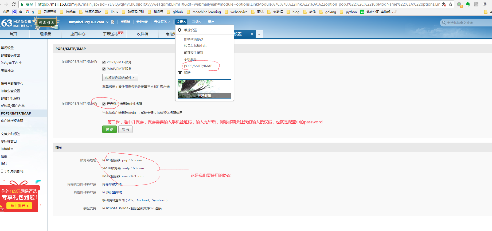
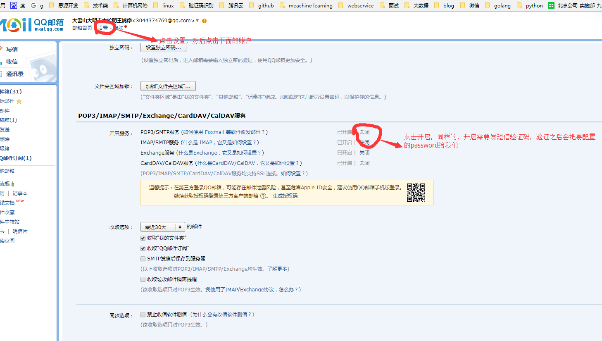

<h1>springBoot发送邮件</h1>
本文主要讲述了如何使用springboot自带的工具发送邮件

- [在pom文件中加入依赖](#在pom文件中加入依赖)   
- [配置application.yml](#配置application.yml)   
- [邮箱配置](#邮箱配置)
- [github示例](#github示例)
<!-- more -->
## 在pom文件中加入依赖
这是springboot自带的工具，我们可以直接使用
```
<!-- JavaMail -->
	<dependency>
		<groupId>org.springframework.boot</groupId>
		<artifactId>spring-boot-starter-mail</artifactId>
	</dependency>
```
## 配置application.yml
在配置文件中配置相关的参数
```

##springBoot的配置
spring.mail.host: smtp.163.com
spring.mail.username: sunyubei12@163.com
#如果是网易邮箱的话，这个是自定义的，如果是qq邮箱，这一项是qq邮箱为我们生成的
spring.mail.password: xxxxxxxx
#协议
spring.mail.protocol: smtp
#端口
spring.mail.port: 25
spring.mail.properties.mail.smtp.auth: true
spring.mail.properties.mail.smtp.starttls.enable: true
spring.mail.properties.mail.smtp.starttls.required: true
spring.mail.default-encoding: UTF-8
```
## 邮箱配置
如果我们要在程序中使用我们的邮箱发送邮件，就必须在邮箱中设置开启SMTP选项
SMTP协议全称为Simple Mail Transfer Protocol，译作简单邮件传输协议，它定义了邮件客户端软件于SMTP服务器之间，以及SMTP服务器与SMTP服务器之间的通信规则
网易邮箱的配置方式

qq邮箱的配置方式

## github示例
这是github示例，里面包含springboot和使用spring自带的JavaMailSenderImpl两种实现方式
[github地址:https://github.com/1315402725/SendMailTest.git](https://github.com/1315402725/SendMailTest.git)