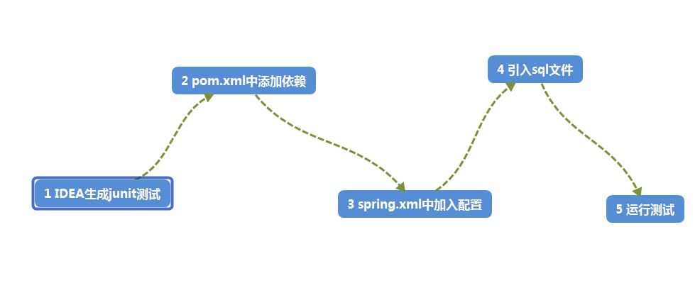
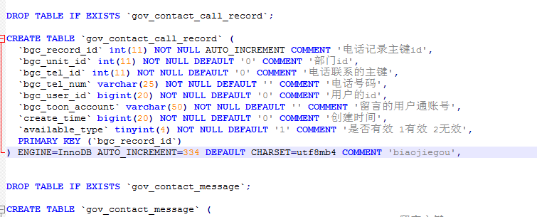
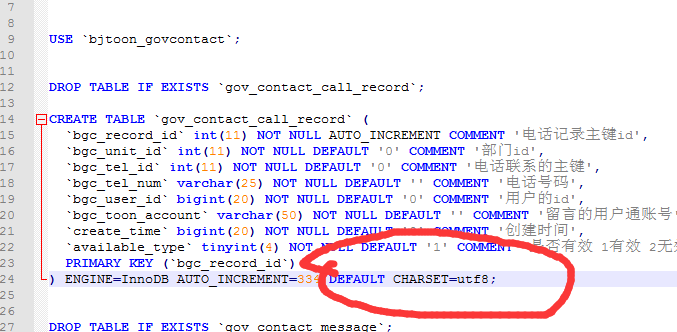

 

<h1>《使用h2做单元测试》</h1>   
H2是Thomas Mueller提供的一个开源的、纯java实现的关系数据库。
h2数据库特点
（1）性能、小巧
（2）同时支持网络版和嵌入式版本，另外还提供了内存版
（3）有比较好的兼容性，支持相当标准的sql标准
（4）提供了非常友好的基于web的数据库管理界面

本文主要讲述了java使用h2做单元测试以及h2数据库在ssm框架和springboot中的配置。

H2数据库是一种由Java编写的，极小，速度极快，可嵌入式的开源数据库。非常适合用在单元测试等数据不需要保存的场景下面。即使换到一个新环境下，mysql数据库依赖不存在了，也能进行单元测试。
比如，你的程序脱离了公司内网环境连不上mysql数据库或者自己的笔记本不想开一个mysql服务，又或者你在调试一个非常恶心的bug,需要数据始终保持一种状态，这时候就可以用h2。

   
- [h2在SSM框架中的配置](#SSM配置H2)   
- [h2在SpringBoot框架中的配置](#SpringBoot配置H2)   
- [github地址(包含两种配置的示例)](#配置示例)
<!-- more -->
## SSM配置H2



### 1 pom.xml中加入依赖
```
<dependency>
   <groupId>com.h2database</groupId>
   <artifactId>h2</artifactId>
   <version>1.4.195</version>
   <scope>test</scope>
</dependency>

```
### 2 配置spring.xml配置文件
```
<!--运行时自启动h2服务 Spring中h2 TCP Server 配置 -->
	<bean id="h2Server" class="org.h2.tools.Server"
		  factory-method="createTcpServer" init-method="start" destroy-method="stop">
		<constructor-arg value="-tcp,-tcpAllowOthers,-tcpPort,9092" />
	</bean>

	<bean id="masterDataSource" class="org.h2.jdbcx.JdbcConnectionPool"
		  destroy-method="dispose">
		<constructor-arg>
			<bean class="org.h2.jdbcx.JdbcDataSource">

				<property name="URL" value="jdbc:h2:mem:zwt_feedback;MODE=MySQL;"/>
				<property name="user" value="root" />
				<property name="password" value="root" />
			</bean>
		</constructor-arg>
	</bean>

	<jdbc:initialize-database data-source="masterDataSource">
		<jdbc:script location="classpath:sql/zwt_feedback.sql"/>
	</jdbc:initialize-database>
```

### 3 引入sql文件
Sql文件里面包括 建表语句以及数据的插入语句
从sqlyog中导出的sql文件需要修改修改，修改内容如下

将最后的逗号换成分号，否则运行时会报错。 


### 4 测试运行


## SpringBoot配置H2

### 1 pom.xml中加入依赖
```
<dependency>
	<groupId>com.h2database</groupId>
	<artifactId>h2</artifactId>
	<scope>runtime</scope>
</dependency>
```
### 2 Application.yml中加入配置
```
#配置数据库连接地址
spring.datasource.url: jdbc:h2:mem:zwt_feedback;MODE=MySQL;
#配置数据库驱动
spring.datasource.driver-class-name: org.h2.Driver
#配置数据库用户名
spring.datasource.username: root
#配置数据库密码
spring.datasource.password: root
#配置能远程访问
spring.h2.console.settings.web-allow-others: true
#配置访问地址
spring.h2.console.path: /h2-console
#配置项目启动 h2就启动
spring.h2.console.enabled: true
#进行该配置后，每次启动程序，程序都会运行resources/db/schema.sql文件，对数据库的结构进行操作。
spring.datasource.schema: classpath:sql/zwt_feedback.sql
#进行该配置后，每次启动程序，程序都会运行resources/db/data.sql文件，对数据库的数据操作。
spring.datasource.data: classpath:sql/data.sql

```

### 3 测试运行


## 配置示例
配置示例，包含两种配置示例以及h2说明文档
[github地址:https://github.com/1315402725/H2Demo.git](https://github.com/1315402725/H2Demo.git)
