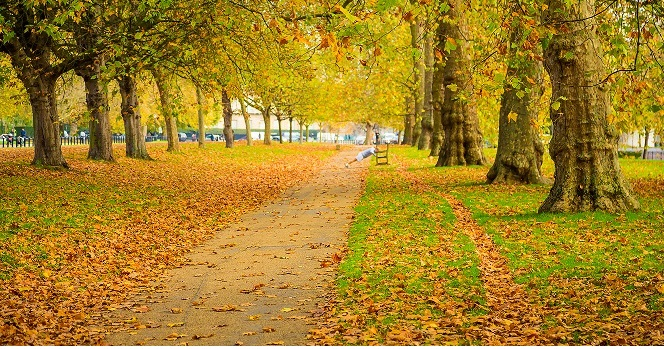
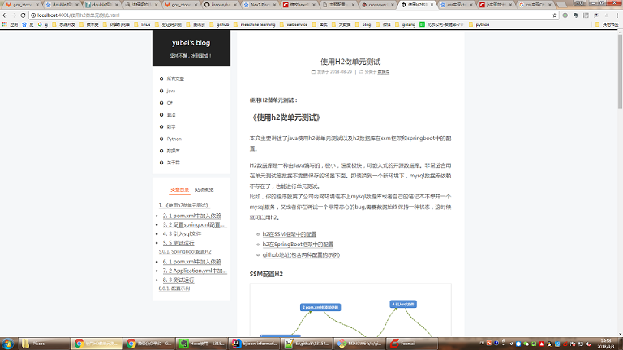
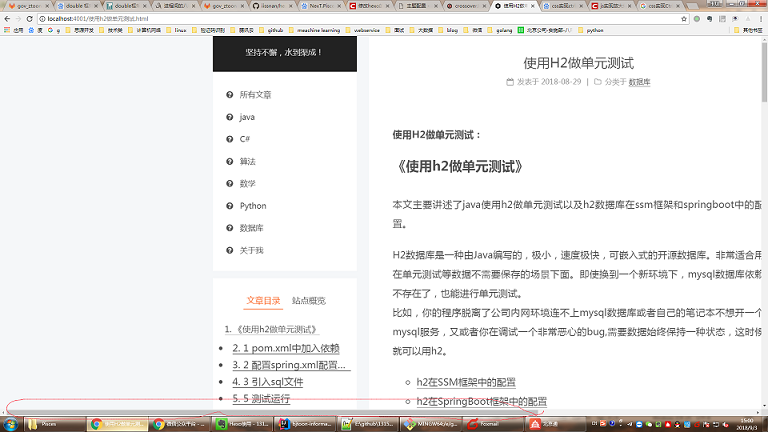
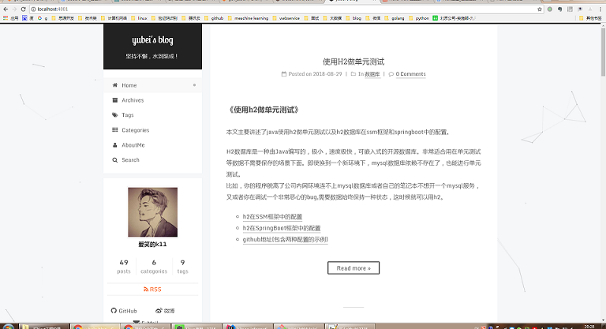

NexT是一款简约版的博客主题， 拥有丰富而简单的配置,且有详细的说明文档。
[Next配置官网:http://theme-next.iissnan.com/](http://theme-next.iissnan.com/)
本文主要讲述了通过css的方式对Hexo配置的Next主题进行放大
话不多说，放大之前。
<!-- more -->

这样看着有点难受，左右有大片空白
一开始我使用了css中的transform堆主题内容进行放大，
在source/css/_schemes/Picses/_layout.styl文件末尾添加如下代码。
```
body {transform: scale(1.5) translate(200px, 100px); }
```

这种配置方式使得博客下方出现滚动条且有一定的失真。浏览器每次加载完页面之后滚动条显示最左边的内容，
显然这种方式不太好，谁也不想看博客的时候再去拉一下下方的滚动条。
后来通过百度，发现了另一中配置方式。
在source/css/_schemes/Picses/_layout.styl文件末尾添加如下代码。
```
body{
zoom : 1.5;
-moz-transform: scale(1.4);-moz-transform-origin: 0 0;
}
```
1.5就是放大倍数。



但是这种配置方式也有一个问题，就是在配置完Canvas_nest动态背景之后，鼠标不会显示在动态线条中心。
这个问题我暂时还没搞定，
